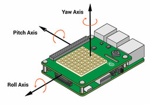

# IoHeat Workshop - 31 October 2019

## Coding a device

Our workshop will introduce the basics concepts of **programming**
in a less usual context: using input/output **electronic components** (like sensors) 
connected to a miniaturized computer, the [Rapspberry Pi](https://www.raspberrypi.org/help/what-%20is-a-raspberry-pi/).

### The Raspberry Pi and the Raspian OS

The Raspberry Pi is a miniaturized computer build to be:
 * Cheap
 * Small (can be [very small](https://www.raspberrypi.org/blog/raspberry-pi-zero/))
 * Easy to use
 * Easy to connect to electronic components
 * Easy to use as a training and prototyping device
 
 Being a computer, you must install an Opearting System. Currently you can install a variety of Linux flavours, and a stripped down [Windows](https://www.microsoft.com/en-us/download/details.aspx?id=55029) version.
 We'll focus on the offically supported Linux distribution called **Rasbpian OS**. It comes with pre-installed software and can easily install Raspberry specific packages (in addition to most software you would use under Linux).
 
### Our sensors kit

You can *manually* connect to your Raspberry Pi a wide range of components, from simple LEDs, to a range of sensors (humidity, temperature, acceleration), small displays, cameras and even fans or motors. 
To have a simple all-in-one training environment, we'll use the SenseHat, an electronic board carrying an 8x8 LED matrix (that can display some output), a joystick and some sensors. You can [learn more here](https://www.raspberrypi.org/blog/sense-hat-projects/).

### Our final project

We well make a "digital die" :game_die:: when we rotate the Raspberry and put the LED matrix in vertical position, we
will display a random number from 1 to 6. To do this we need to be able to code in Python and interact with the accelerometer to get the position of the Raspberry in the space, and to print a number on the screen.


:bulb: We already configured the Raspberries for the workshop. Should you wish to try at home, read how to [install the required packages](setup.md).

## Getting started with Python
 
We will use a programming language called Python for our workshop, mainly because it's incredibly useful in data science (and bioinformatics). A nice bonus is that is quite simple.

Open the "**Thonny**" program from the Rasbperry menu -> programming. You will see that it has three sections, one being the editor where we can write our program, and below (called _shell_), a section where we will be able to see the execution of our program.

:bulb: Note that the full version of the scripts, with comments, is available in this directory!

Try this first program, saving it as '`hello.py`':
```
teamName = 'IoHeat team'
print('Hello, ' + teamName + '!')
```
You can execute the script pressing the green arrow button, or F5 from the keyboard.

To use our SenseHat, we'll need to _extend_ Python core capabilities using a specific module. Let's try writing a letter on the LED matrix (`letter.py`):
```
from sense_hat import SenseHat
myHat = SenseHat()
myHat.show_letter('A')
```
What happens if you pass as argument of the `show_letter()` function the value `'IoHeat'`?
Familiarizing with the _errors_ reported, is a very important step in our journey in Python.

To address our problem: there is a more appropriate function that will accept a _string_ instead of a single _character_:

```
from sense_hat import SenseHat
myHat = SenseHat()
myHat.show_message('IoHeat')
```
## Getting a reading from a sensor

The `get_pressure()` function provided by SenseHAT will return the pressure in millibars. We can simply convert it to atmospheres and then print the result (save this as `barometer.py`). The full list of functions provided by the SenseHat is [documented here](https://pythonhosted.org/sense-hat/api/).
```
from sense_hat import SenseHat
sense = SenseHat()
pressure_mbars = sense.get_pressure()
pressure_atm   = pressure_mbars / 1013.25
print("Pressure: {} Millibars ({} atm)".format(pressure_mbars, pressure_atm))
```

The last _print_ function uses the _format_ method to put the content of two variables using `{}` as placeholders. For example, in the `hello.py` script you can write: `print('Hello, {}!'.format(teamName) )`.

## Rolling a die :game_die:

Now let's generate a random number from 1 to 6, and print it on the LED matrix (`die.py`):
```
from sense_hat import SenseHat
import random 

myHAT =  SenseHat()
number = random.randint(1,6)

print('You got {}'.format(number))
myHAT.show_letter( str(number) )
```

## Printing an image on the LED matrix
For this, see the `[logo.py](logo.py)` script. Try changing the colors, and even the image!

The screen has a default "horizon line", but we can rotate it. See `[logo_rotate.py](logo_rotate.py).py` for this.

## Getting the spatial position with the accelerometer

A first script is `accelerometer_1.py` that shows how to retrieve the 3D position of the device.
This will introduce a complex data structure called dictionary with three keys, _x_, _y_ and _z_ and their respective value.

The script also introduces an _infinite loop_ that is we repeat a set of instruction indefinitely (see [script](accelerometer_1.py)).




After getting an idea of what the accelerometer does, we can use the information to light a single pixel of the matrix. We cover this in [accelerometer_2.py](accelerometer_2.py).

## Putting it all together

Given the elements described we have everything we need to make an amazing toy: a digital die!
See: [rolldie.py](rolldie_2.py).
